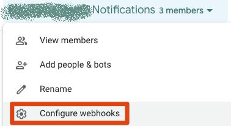
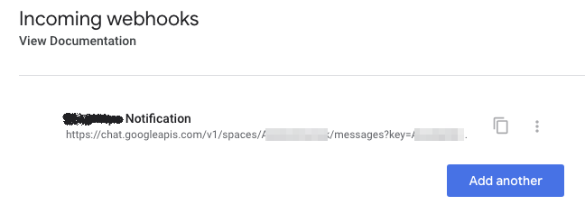
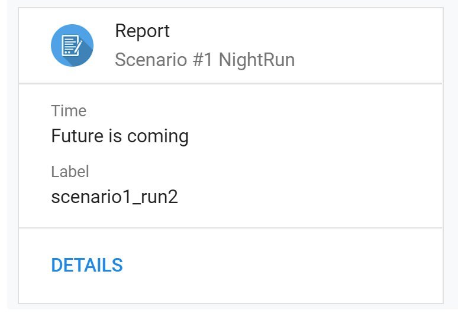

# gChatNotifier

Simple python script to send notification/short report to gChat

# HowTo Use

## Add an Incoming Webhook to your Hangouts Chat

To add an incoming webhook to Hangouts Chat, start by creating a room (or take an existing room) and then from the top menu select “Configure webhooks”:  
  
On the subsequent page, give your bot a name.  
  
Click save, and Hangouts Chat is now ready to receive notifications from the script. Copy the URL provided to use in our next step:  
  

## Cache webhook

```bash
python gChatNotifier.py --init -w <webhook_url>
```

## Send notification

```bash
python gChatNotifier.py -e "Time::Future is coming" -e "Label::scenario1_run2 --details_url "google.com" --title "Report" --subtitle="Scenario #1 NightRun"
```


